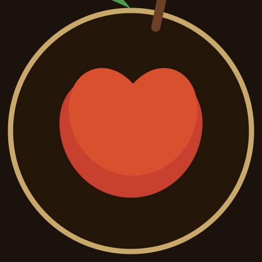

# Pop-a-pples — Cinematic Gourmet Apples

> **Gourmet Apples, Hand-Coated Daily** — An immersive, scroll-driven brand experience combining cinematic storytelling with premium ecommerce.

> **🌐 Live site:** <https://kenclarkz.github.io/pop-a-pples/>



---

## 🍎 What is this?

This repo is a **reusable brand template**. It was forked from the *Lo's Flan*
cinematic site and re-skinned for **Pop-a-pples** (gourmet apples). Every
brand-specific string, colour, product and media file is isolated so you can
clone it, drop in new media, and push a brand-new site.

**To re-use it for another brand:**

1. `git clone` this repo and rename the folder/package (see [Rebranding](#-rebranding)).
2. Swap the media (see [📷 Using Your Own Media](#-using-your-own-media)).
3. Push to your own GitHub repo — the base path follows the repo name automatically.

---

## ✨ Features

### Cinematic Homepage Experience
- **Scroll-scrubbed hero video** — a full-screen video that plays forward/back
  with the wheel (`public/assets/video/POP.mp4`). Mobile-optimised (H.264
  first, lazy preload, smooth scrubbing). If no video exists, it falls back to
  a slow Ken Burns zoom on `public/assets/journey/hero.png`.
- **6 scroll-driven chapters** telling the apple journey: The Apple → Orchard → Dip → Toppings → Set → Reveal
- **Photo-driven** — drop a photo per chapter into `public/assets/journey/` and it replaces the placeholder automatically (no code changes)
- **Fire burn transitions** — a full-screen WebGL layer shows the current photo and, when you scroll to the next chapter, consumes it with a flame-edged fire effect revealing the next photo
- **3D product reveal** — the final chapter spins your Blender apple model (`/assets/apple/apple.glb`); a procedural caramel-apple placeholder renders until you add one
- **Elegant built-in placeholders** (generated, see `tools/generate-placeholders.mjs`) until real photos are added
- **Smooth scrolling** via Lenis
- Scroll-linked text reveals, status/progress overlays, and a final CTA — all driven by scroll position
- A `components/three/` library (Three.js/R3F) remains available for future 3D scenes

### Premium Ecommerce (`/products`)
- **Modular product data** in `data/products.ts` — add products by appending objects
- **Category filtering** (Classic, Specialty, Seasonal, Party, Gift)
- **Size selection** with per-size pricing
- **Quick-view modal** with ingredients, allergens, quantity
- **Cart drawer** with localStorage persistence
- **Stripe-ready** checkout placeholder

### Additional Pages
- `/about` — Brand story, timeline, values, process
- `/contact` — Contact form, hours, catering & wholesale inquiries

---

## 🛠️ Tech Stack

| Layer | Technology |
|-------|------------|
| Framework | Next.js 14 (App Router) |
| Language | TypeScript 5.6 |
| Styling | Tailwind CSS 3.4 |
| 3D | Three.js r160, React Three Fiber 8.17, Drei 9.114 |
| Animation | GSAP 3.12 + ScrollTrigger |
| Smooth Scroll | Lenis 1.1 |
| Icons | Lucide React |
| State | React Context + localStorage |

---

## 🚀 Quick Start

```bash
# Install dependencies
npm install

# Development server (serves under /pop-a-pples to match GitHub Pages paths)
npm run dev        # → http://localhost:3000/pop-a-pples

# Static export build (see 📦 Deployment)
npm run build
npx serve out      # preview the exported site (serves /pop-a-pples/...)

# Lint & typecheck
npm run lint
npm run typecheck

# Regenerate placeholder media (logo, journey backdrops, product images)
node tools/generate-placeholders.mjs
```

---

## 📁 Project Structure

```
├── app/
│   ├── page.tsx                 # Home (scroll-scrubbed hero video)
│   ├── products/page.tsx        # Ecommerce menu
│   ├── about/page.tsx           # Brand story
│   ├── contact/page.tsx         # Contact form + info
│   ├── layout.tsx               # Root layout + providers
│   └── globals.css              # Design system
├── components/
│   ├── ScrollVideo.tsx          # Scrub-video hero (+ photo fallback)
│   ├── HeroApple.tsx            # Scene 1
│   ├── OrchardScene.tsx         # Scene 2
│   ├── DipScene.tsx             # Scene 3
│   ├── ToppingsScene.tsx        # Scene 4
│   ├── SetScene.tsx             # Scene 5
│   ├── FinalProduct.tsx         # Scene 6 (3D reveal)
│   ├── Flan3D.tsx               # WebGL reveal canvas (procedural apple fallback)
│   ├── JourneyFireCanvas.tsx    # WebGL fire-burn photo backdrop
│   ├── ProductCard.tsx          # Ecommerce card + quick view
│   ├── ProductVideo.tsx         # In-view looping product video (+ poster fallback)
│   ├── ProductGrid.tsx          # Grid of ProductCards
│   ├── PriceDisplay.tsx         # Formatted pricing
│   ├── Navigation.tsx           # Header nav + cart button
│   ├── Footer.tsx               # Footer + newsletter
│   ├── CartDrawer.tsx           # Slide-over cart
│   ├── Reveal.tsx               # Scroll-triggered fade/slide
│   ├── SceneShell.tsx           # Pinned section wrapper
│   └── three/                   # 3D primitives (Lighting, GatedCanvas, GlbModel…)
├── data/
│   ├── products.ts              # Product catalog (source of truth)
│   └── site.ts                  # Site config, nav, chapters ← edit your brand here
├── lib/
│   ├── paths.ts                 # Base-path-aware `asset()` helper
│   ├── anim.ts / lenis.ts       # GSAP + Lenis setup
│   ├── usePinnedScene.ts        # ScrollTrigger pin + progress hook
│   ├── cart.tsx                 # Cart context + persistence
│   ├── assets.ts                # Asset existence detection
│   └── utils.ts                 # clsx helper
├── public/assets/
│   ├── brand/logo.png             # Business logo (nav, footer, favicon)
│   ├── products/*.svg           # Product poster images
│   ├── products/videos/         # Menu videos — videos/<category>/<product-id>.mp4
│   ├── journey/                 # Drop chapter photos here (hero, orchard, dip, toppings, set, reveal)
│   ├── apple/                   # Drop apple.glb here
│   └── video/                   # Drop POP.mp4 + POP-h264.mp4 here
├── tools/generate-placeholders.mjs  # Regenerate all placeholder media
├── BLENDER_GUIDE.md             # Full Blender integration docs
├── .github/workflows/ci.yml     # GitHub Actions CI
└── README.md                    # This file
```

---

## 🎨 Rebranding

Everything brand-specific lives in a handful of spots:

| What | Where |
|------|-------|
| Name, tagline, contact, nav, chapters | `data/site.ts` |
| Product catalog, categories, pricing | `data/products.ts` |
| SEO metadata, social preview | `app/layout.tsx` |
| Story copy + timeline | `app/about/page.tsx` |
| Contact copy | `app/contact/page.tsx` |
| Chapter copy (6 scenes) | `components/HeroApple.tsx` … `components/SetScene.tsx` |
| Colour palette | `tailwind.config.ts` + `app/globals.css` |
| Logo / favicon | `public/assets/brand/` + `app/icon.png` |
| Base path / repo slug | `package.json` → `name` (everything follows) |

**The base path is derived from `package.json` `name`** via `next.config.mjs`
and `lib/paths.ts`, so the site deploys correctly under *any* GitHub repo name
with zero config. Set `NEXT_PUBLIC_BASE_PATH` to override.

---

## 📷 Using Your Own Media

### Hero video (homepage)
Drop a scrub-friendly MP4 into `public/assets/video/`:

```
public/assets/video/POP.mp4            # HEVC/H.265 (preferred on Safari)
public/assets/video/POP-h264.mp4       # H.264 fallback (Android/mobile/desktop)
public/assets/video/POP-poster.jpg     # poster frame
```

Drop your exported `POP.mp4` (and a mobile-friendly `POP-h264.mp4`) into that
folder with these exact names and the homepage scrub video updates
automatically — no code changes needed.

No video? The hero falls back to `public/assets/journey/hero.png` with a slow
zoom — the template never looks broken.

### Chapter photos (the 6-scene journey)
Drop one photo per chapter into `public/assets/journey/` — it replaces the
placeholder instantly, no code changes. Supported formats: `png`, `jpg`,
`jpeg`, `webp`.

| Chapter | Filename | Suggested subject |
|---------|----------|-------------------|
| 01 The Apple | `hero` | Hero apple shot on the counter |
| 02 The Orchard | `orchard` | Apples / orchard scene |
| 03 The Dip | `dip` | Apple being coated in caramel |
| 04 The Toppings | `toppings` | Apple scattered with toppings |
| 05 The Set | `set` | Apples resting on a cooling rack |
| 06 Reveal | — (3D) | Replaced by the full-screen 3D apple — no photo needed |

Example: drop `public/assets/journey/dip.png` and chapter 03 shows it
full-screen behind the chapter text.

### 3D reveal apple
Drop a Blender export at `public/assets/apple/apple.glb`. Until then, a
procedural caramel-apple placeholder renders in the reveal scene. See
**[BLENDER_GUIDE.md](BLENDER_GUIDE.md)** for authoring specs.

### Placeholders
Run `node tools/generate-placeholders.mjs` to regenerate the branded
placeholder logo, journey backdrops and product images.

---

## 🎬 Replacing Placeholders with Blender Assets

See **[BLENDER_GUIDE.md](BLENDER_GUIDE.md)** for complete instructions.

**TL;DR:**
1. Model in Blender (meters, PBR materials)
2. Export `.glb` to matching `public/assets/` folder
3. App detects it automatically — no code changes needed

For cinematic sequences: render PNG sequences or MP4 to `public/assets/sequences/<scene>/`

---

## 🎨 Design System

### Colors (Tailwind config)
```css
cream:      #F6EFE3 (base) / #ECE0CB (dark) / #E0D1B8 (deep)
crimson:    #C8402E (base) / #E05A3F (light) / #A62E20 (dark)
caramel:    #C8894B (base) / #D9A36A (light) / #A96A2F (dark)
gold:       #C9A96A (base) / #E3C88C (light) / #A8873F (dark)
leaf:       #4E9C4E (base) / #6DB86D (light) / #3C7F3C (dark)
cocoa:      #4A3224 / #3E2A1E
espresso:   #1B120C / #120C08
blush:      #E9C3B0
sage:       #BFD8C6
```

### Typography
- **Display/Serif**: Cormorant Garamond (Google Fonts)
- **UI/Sans**: Jost (Google Fonts) + system fallback

---

## 📦 Deployment

### GitHub Pages
The site deploys from `main` via `.github/workflows/pages.yml` (a static export
in `out/`). The base path is set automatically from the repo name.

To enable: **Settings → Pages → Source: GitHub Actions**, then push to `main`.
Every push rebuilds and redeploys automatically.

```bash
# Build the static export with the GitHub Pages base path
NEXT_PUBLIC_BASE_PATH=/pop-a-pples npm run build
# Output in /out
```

> Local dev serves under `/pop-a-pples/` too (e.g. `http://localhost:3000/pop-a-pples/`)
> so asset paths match production. `lib/paths.ts` supplies the base-path-prefixed
> `asset()` helper used for every raw asset URL.

### Vercel (Optional)
```bash
vercel --prod
```
- Automatic static optimization
- Edge caching for `public/assets/`
- Zero-config preview deployments

### Static Export (GitHub Pages, Netlify, Cloudflare Pages)
```bash
# next.config.mjs
output: 'export',
images: { unoptimized: true }
```
```bash
npm run build
# Output in /out
```

---

## 🔧 Available Scripts

| Command | Description |
|---------|-------------|
| `npm run dev` | Start dev server (serves under `/pop-a-pples`) |
| `npm run build` | Static export build (outputs to `out/`) |
| `npm run lint` | ESLint (Next.js config) |
| `npm run typecheck` | TypeScript compile check |
| `node tools/generate-placeholders.mjs` | Regenerate placeholder media |

---

## 📄 License

MIT — feel free to use for learning, inspiration, or as a starter for your own cinematic ecommerce experiences.

---

## 🙏 Credits

- **3D**: Three.js, React Three Fiber, Drei (Poimandres)
- **Animation**: GSAP (GreenSock)
- **Scroll**: Lenis (Studio Freight)
- **Fonts**: Cormorant Garamond (Catharsis Fonts), Jost (Indestructible Type)
- **Icons**: Lucide

---

*Built with obsession for the perfect apple.*
